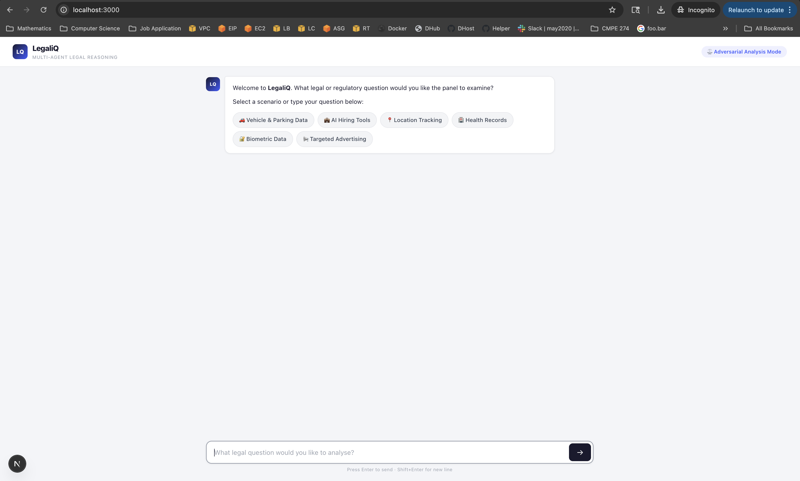
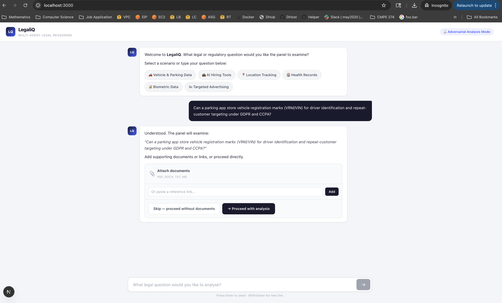
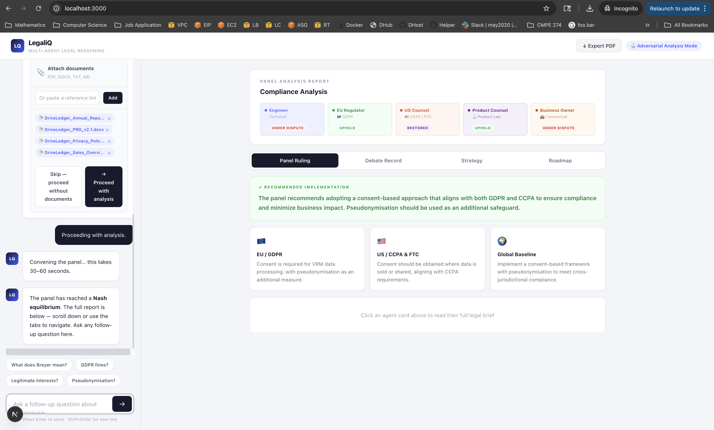
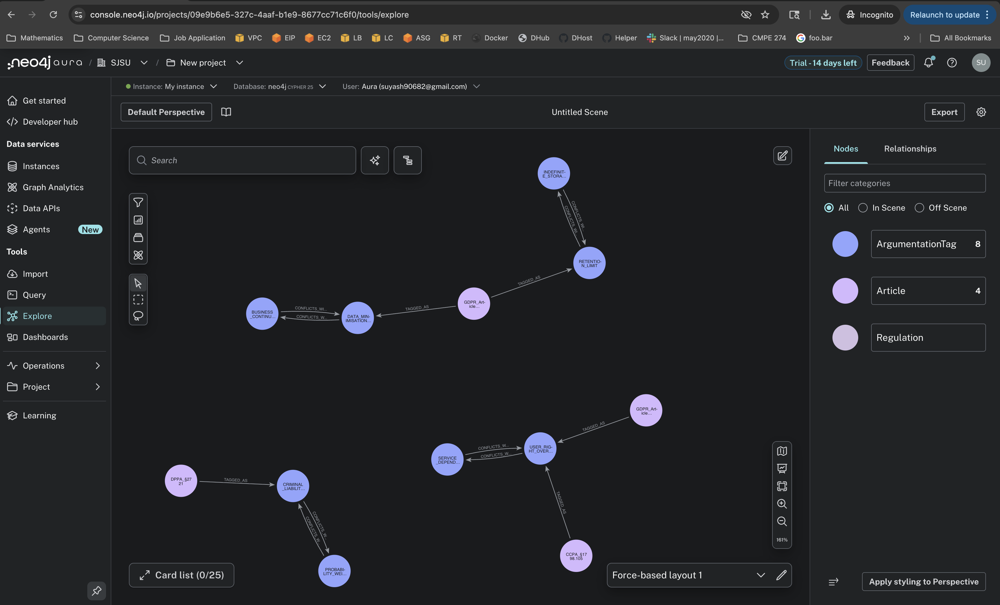

# LegalIQ — Multi-Agent Legal Reasoning System

LegalIQ is an adversarial legal reasoning engine that simulates a panel of five AI counsel agents debating a compliance question, grounded in a Neo4j legal knowledge graph. It produces structured outputs: exchange transcripts, argument maps, strategy matrices, panel rulings, and implementation roadmaps.

## Screenshots

| Chat Interface | Document Upload |
|---|---|
|  |  |

| Compliance Analysis Report | Neo4j Knowledge Graph |
|---|---|
|  |  |

---

## How It Works

```
Legal Question
      │
      ▼
 GPT-4o extracts relevant legal tags
      │
      ▼
 Neo4j graph query
 (articles, conflicts, regulations)
      │
      ▼
 GPT-4o runs 5-agent adversarial session
      │
      ▼
 Animated UI renders results
```

### The Five Agents

| ID | Role | Perspective |
|----|------|-------------|
| A1 | Engineer | Technical pseudonymisation defences, operational data arguments |
| A2 | EU Regulator | GDPR maximalist — Breyer standard, Recital 30, data subject rights |
| A3 | US Counsel | CCPA / FTC pragmatist, business-friendly US law |
| A4 | Product Counsel | Cross-jurisdictional compromise, consent-based implementation |
| A5 | Business Owner | Commercial viability, least-friction approach |

---

## Repository Structure

```
legalIQ/
├── ingest.py               # Neo4j ingestion pipeline (Excel → graph)
├── seed_conflict_edges.py  # Seeds CONFLICTS_WITH edges between tags
├── verify.py               # Post-ingestion verification queries
├── neo4j_http.py           # Lightweight Neo4j HTTP Query API v2 client
├── requirements.txt        # Python dependencies
├── schema.md               # Graph schema documentation
└── web/                    # Next.js 16 frontend + API routes
    ├── app/
    │   ├── page.tsx                  # Main UI
    │   └── api/reason/route.ts       # Core reasoning API endpoint
    ├── components/
    │   ├── ChambersExchange.tsx      # Animated sequential debate
    │   ├── ArgumentMap.tsx           # SVG argument graph
    │   ├── BriefPanel.tsx            # Per-agent legal brief
    │   ├── StrategyMatrix.tsx        # Nash equilibrium donut charts
    │   ├── DecisionMemo.tsx          # Panel ruling + jurisdiction grid
    │   └── NextSteps.tsx             # Expandable implementation roadmap
    └── lib/
        ├── neo4j.ts                  # Neo4j query helpers
        └── extract.ts                # Document text extraction
```

---

## Graph Schema

### Nodes

| Label | Key Properties |
|-------|---------------|
| `Regulation` | `name`, `jurisdiction` |
| `Article` | `article_id` (unique), `section`, `text`, `what_it_covers`, `sheet_source` |
| `ArgumentationTag` | `tag_name` (unique), `tag_type` |

**Tag types:** `classification`, `constraint`, `right`, `risk`, `requirement`, `rule`

### Relationships

| Relationship | Direction | Description |
|---|---|---|
| `BELONGS_TO` | Article → Regulation | Each article belongs to one regulation |
| `TAGGED_AS` | Article → ArgumentationTag | Tags applied to each article |
| `CONFLICTS_WITH` | Tag ↔ Tag | Bidirectional conflict pairs |

**Conflict pairs seeded:**
- `DATA_MINIMISATION_CONSTRAINT ↔ BUSINESS_CONTINUITY`
- `RETENTION_LIMIT ↔ INDEFINITE_STORAGE`
- `CRIMINAL_LIABILITY ↔ PROBABILITY_WEIGHTED_REASONING`
- `USER_RIGHT_OVERRIDE ↔ SERVICE_DEPENDENCY`

---

## Setup

### Prerequisites

- Python 3.12+
- Node.js 20+
- Neo4j Aura instance (or local Neo4j)
- OpenAI API key

### 1. Environment Variables

Create `.env` in the repo root (for Python scripts) and `web/.env` (for Next.js):

```env
NEO4J_URI=neo4j+s://<your-instance>.databases.neo4j.io
NEO4J_USER=neo4j
NEO4J_PASSWORD=<your-password>
OPENAI_API_KEY=sk-...
```

### 2. Ingest Legal Data

```bash
pip install -r requirements.txt

# Ingest the Excel database into Neo4j
python3 ingest.py --xlsx /path/to/Legal_database_LegaliQ.xlsx

# Seed conflict edges
python3 seed_conflict_edges.py

# Verify the graph
python3 verify.py
```

Expected output after ingestion:
```
Article: 18  |  Regulation: 6  |  ArgumentationTag: 40
BELONGS_TO: 18  |  TAGGED_AS: 37  |  CONFLICTS_WITH: 8
```

### 3. Run the Web App

```bash
cd web
npm install
npm run dev
```

Open [http://localhost:3000](http://localhost:3000).

---

## Usage

1. Select a scenario (Vehicle & Parking Data, AI Hiring Tools, etc.) or type a custom legal question
2. Optionally expand **Add company context** to provide per-agent context (technical architecture, jurisdiction details, product specs, etc.)
3. Click **Run Analysis**
4. Watch the adversarial debate animate in — each counsel submission reveals sequentially
5. After the exchange, explore:
   - **Argument Map** — click agent nodes to read full legal briefs
   - **Nash Equilibrium Analysis** — three strategy options scored and ranked
   - **Panel Ruling** — synthesised cross-jurisdiction finding
   - **Implementation Roadmap** — click steps to expand action checklists

---

## Tech Stack

| Layer | Technology |
|-------|-----------|
| Frontend | Next.js 16, React, Tailwind CSS |
| AI Reasoning | OpenAI GPT-4o |
| Knowledge Graph | Neo4j Aura (HTTP Query API v2) |
| Data Ingestion | Python, pandas, openpyxl |
| Deployment | Vercel (frontend) |
