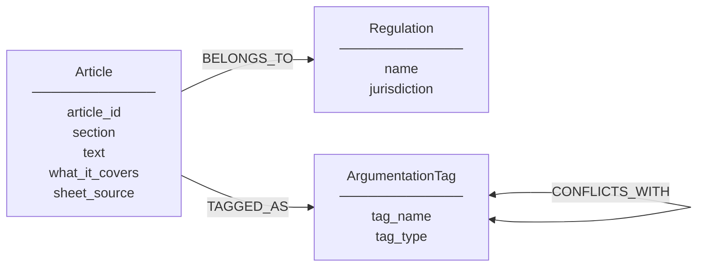
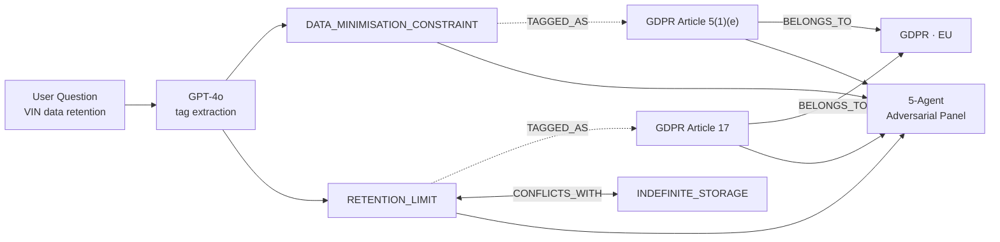
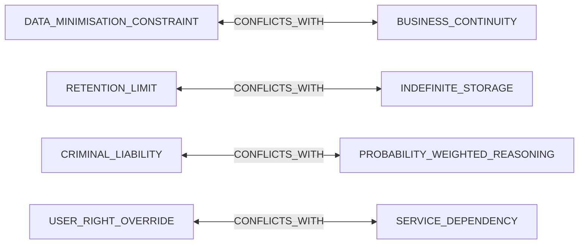

# LegalIQ — Graph Schema Diagrams

## Node & Relationship Structure

```mermaid
graph LR
    REG["Regulation
    ─────────────
    name
    jurisdiction"]

    ART["Article
    ─────────────
    article_id
    section
    text
    what_it_covers
    sheet_source"]

    TAG["ArgumentationTag
    ─────────────
    tag_name
    tag_type"]

    ART -->|BELONGS_TO| REG
    ART -->|TAGGED_AS| TAG
    TAG <-->|CONFLICTS_WITH| TAG
```

---

## End-to-End Reasoning Flow (Concrete Example)

```mermaid
graph LR
    Q["User Question
    VIN data retention"]

    T1[DATA_MINIMISATION_CONSTRAINT]
    T2[RETENTION_LIMIT]
    T3[INDEFINITE_STORAGE]

    A1["GDPR Article 5(1)(e)"]
    A2["GDPR Article 17"]
    R["GDPR · EU"]

    GPT["GPT-4o
    tag extraction"]
    PANEL["5-Agent
    Adversarial Panel"]

    Q --> GPT
    GPT --> T1
    GPT --> T2
    T1 -.->|TAGGED_AS| A1
    T2 -.->|TAGGED_AS| A2
    A1 -->|BELONGS_TO| R
    A2 -->|BELONGS_TO| R
    T2 <-->|CONFLICTS_WITH| T3
    T1 & T2 & A1 & A2 --> PANEL
```

---

## Conflict Pairs

```mermaid
graph LR
    DM[DATA_MINIMISATION_CONSTRAINT] <-->|CONFLICTS_WITH| BC[BUSINESS_CONTINUITY]
    RL[RETENTION_LIMIT] <-->|CONFLICTS_WITH| IS[INDEFINITE_STORAGE]
    CL[CRIMINAL_LIABILITY] <-->|CONFLICTS_WITH| PR[PROBABILITY_WEIGHTED_REASONING]
    UR[USER_RIGHT_OVERRIDE] <-->|CONFLICTS_WITH| SD[SERVICE_DEPENDENCY]
```
